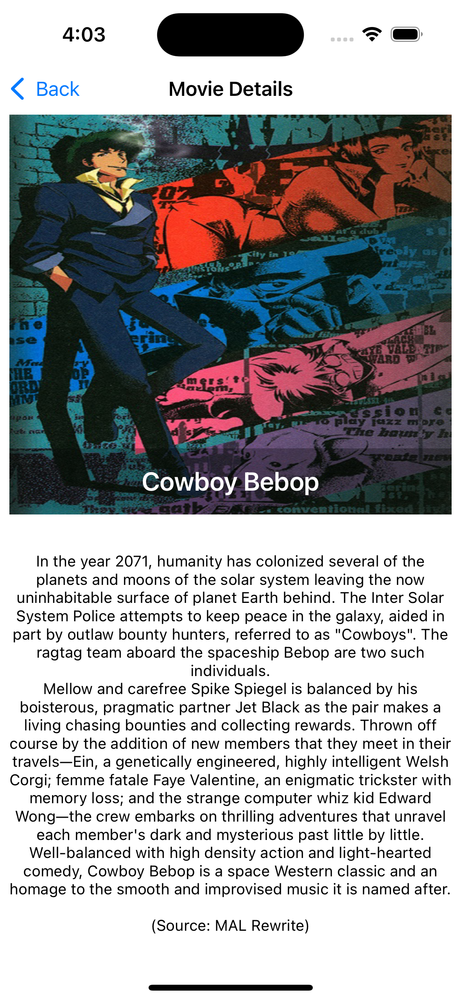

# AnimationMovieApp

<p align="center">
  
  
</p>

MovieApp is an iOS application that allows users to explore and discover popular and trending animated movies. It fetches data from the open [Kitsu API](https://kitsu.docs.apiary.io/) and presents the content in a visually engaging, responsive interface.

## Features

- **Trending Anime Movies**: View a list of trending and top-rated animated movies from the Kitsu API.
- **Movie Details**: Tap on any item to explore its detailed information including title, release date, and average rating.
- **Cover Images**: Each movie showcases a cover image fetched dynamically via the API.
- **Responsive UI**: The layout adapts gracefully across various screen sizes and orientations.
- **Clean Design**: Built with modern iOS UI principles for a smooth and user-friendly experience.

## Technologies Used

- **Swift**
- **UIKit**
- **URLSession** for networking
- **Kitsu API** for fetching anime movie data
- **Auto Layout** for responsive UI

## Installation

To run the MovieApp on your local machine, follow these steps:

1. Clone the repository:
```
git clone https://github.com/Arun738/AnimationMovieApp.git
``` 
2. Open the project in Xcode.
3. Build and run the project on a simulator or a physical device

## API Integration
This app uses the public Kitsu API to retrieve anime-related data. No authentication key is required for this integration.

Sample request:

GET https://kitsu.io/api/edge/anime

## Screenshots

<p align="center">
  
  
</p>

## License

This project is licensed under the MIT License. You are free to modify, distribute, and use the code for personal and commercial purposes.

## Acknowledgements

This project acknowledges the following:

- Kitsu.io for their free and open API.
- SDWebImage library for simplifying image loading and caching.
